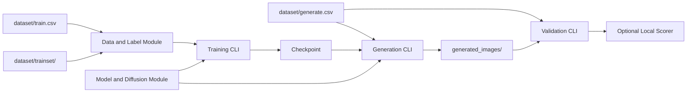

# High-Level Design

## Overview

This design turns the proposal into a small, reproducible HW6 pipeline for from-scratch conditional Brainrot image generation.

The architecture has four user-facing flows:

1. Load and validate assignment data from `dataset/train.csv`, `dataset/trainset/`, and `dataset/generate.csv`.
2. Train a from-scratch conditional DDPM denoiser on 64x64 RGB images.
3. Generate exactly 2,000 PNG files from `dataset/generate.csv` into `generated_images/`.
4. Validate generated files before optional local scoring or submission packaging.

The design stays intentionally small: one model/training path, one generation path, and one validation path.

## Goals

- Train the main image generator from scratch.
- Generate exactly 2,000 RGB PNG images at 64x64.
- Use filenames and conditions from `dataset/generate.csv`.
- Keep animal and object conditioning explicit.
- Provide reproducible commands and recorded settings for teaching assistant verification.
- Add a project-owned validation gate for generated output format and filenames.
- Keep generated images, checkpoints, datasets, and scorer outputs out of source control unless packaging is explicitly requested.

## Non-Goals

- Do not implement a high-level pretrained generation pipeline.
- Do not use pretrained generator weights.
- Do not build a general research framework.
- Do not support multiple model families in the first implementation.
- Do not solve final Codabench tuning in the architecture document.
- Do not treat local scoring as final-submission-equivalent until the missing local reference files and 2,000-vs-3,000 mismatch are resolved.

## Requirements Summary

| Area | Requirement | Source |
| --- | --- | --- |
| Training data | Use `dataset/train.csv` and `dataset/trainset/` with 4,799 images | `doc/problem-brief.md` |
| Generation data | Use `dataset/generate.csv` with 2,000 rows | `doc/problem-brief.md`, `doc/proposal.md` |
| Output | 2,000 RGB PNG files, 64x64, names matching `generate.csv` | `doc/problem-brief.md`, `doc/proposal.md` |
| Model constraint | Main generator trained from scratch; no pretrained generator weights | `doc/problem-brief.md`, `doc/proposal.md` |
| Architecture direction | Small label-conditioned DDPM with from-scratch UNet backbone | `doc/proposal.md` |
| Evaluation | Official scoring uses FID and CLIP-T | `doc/problem-brief.md` |
| Local quality gate | Add generated-output validation before scoring/submission | `doc/quality-gates.md`, `doc/proposal.md` |
| Documentation | README must document setup, training, generation, and checkpoint | `doc/problem-brief.md`, `doc/proposal.md` |

## Proposed Architecture

The repository should expose a direct command-line workflow around a shared model/diffusion module.



Confirmed architecture decisions:

- Use one main conditional DDPM path for baseline training and generation.
- Keep model and diffusion logic shared by training and generation.
- Keep output validation separate from scoring, because the assignment output contract is stricter and cheaper to verify than evaluator execution.
- Treat local scoring as optional until its input setup is resolved.

Open architecture decisions:

- Exact Python, CUDA, and PyTorch versions.
- Final model size and training duration.
- Whether local diagnostics use pretrained CLIP outside the main generator.

## Modules

| Module | Responsibility | Inputs | Outputs | Owned Data | Dependencies | Externally Visible Behavior | Source Traceability |
| --- | --- | --- | --- | --- | --- | --- | --- |
| Data and Label Module | Read CSV metadata, map animal/object labels, load 64x64 RGB training images, expose generation rows | `dataset/train.csv`, `dataset/trainset/`, `dataset/generate.csv` | Training samples, generation requests, label mappings | Animal/object mappings derived from CSVs | Standard CSV/file/image handling; training CLI; generation CLI | Fails early when required rows/files/classes are missing | Proposal: Proposed Approach, Validation Plan; Problem Brief: Required Inputs |
| Model and Diffusion Module | Define the from-scratch conditional denoiser, conditioning inputs, diffusion schedule, training loss, and sampler contract | Noisy images, timesteps, animal IDs, object IDs | Predicted noise during training; sampled RGB tensors during generation | Model weights and diffusion constants inside checkpoints/config | Training CLI, generation CLI | Provides one generator architecture trained without pretrained generator weights | Proposal: Algorithm Strategy; Problem Brief: Constraints |
| Training CLI | Train the model, run the small overfit check when requested, save checkpoint and training settings | Training samples, model settings, seed, output checkpoint path | Checkpoint, recorded run settings, optional sample previews | Checkpoint metadata needed for generation/reproduction | Data and Label Module, Model and Diffusion Module | User runs one documented training command | Proposal: Module Candidates, Milestones |
| Generation CLI | Load a checkpoint and generate images for every row in `generate.csv` | Checkpoint, `dataset/generate.csv`, output directory | `generated_images/{id}` PNG files | None beyond generated image files | Data and Label Module, Model and Diffusion Module | User runs one documented generation command that writes requested filenames | Proposal: Module Candidates; Problem Brief: Required Outputs |
| Generated Output Validator | Verify the submission image contract before scoring/upload | `dataset/generate.csv`, generated image directory | Pass/fail report | None | File/image readers | Checks count, exact filenames, PNG format, RGB mode, and 64x64 size | Proposal: Validation Plan; Quality Gates: Recommended Minimum Done Criteria |
| Documentation and Environment Manifest | Document setup, commands, checkpoint, seed/config, and package versions | Final implementation choices, run results | `README.md`, `requirements.txt` or equivalent | Reproducibility instructions | Training CLI, Generation CLI, Validator | Teaching assistants can reproduce training and generation flow | Problem Brief: Required Deliverables; Proposal: Module Candidates |
| Optional Local Scoring Adapter | Prepare or document generated images for the provided scorer once local inputs are complete | Valid generated images, scorer input layout | Local `scores.json` from scorer | Scorer outputs, not source-owned | Provided `scoring_program/score.py` | Runs only after approval and setup resolution | Quality Gates: Benchmark or Evaluator Commands |

## Module Relationships

| Type | Source | Target | Direction and Ownership | Contract | Status |
| --- | --- | --- | --- | --- | --- |
| Data flow | Data and Label Module | Training CLI | Training owns iteration; data module owns parsing/mapping | Image tensor plus animal/object IDs | Confirmed by proposal |
| Data flow | Data and Label Module | Generation CLI | Generation owns requested output loop; data module owns CSV rows/mappings | `id`, animal ID, object ID, prompt text if needed | Confirmed by proposal |
| Call | Training CLI | Model and Diffusion Module | Training calls model/loss during optimization | noisy image, timestep, labels -> predicted noise/loss | Confirmed by proposal |
| Persistence | Training CLI | Checkpoint | Training creates checkpoint; generation consumes it | Model weights plus enough settings to sample reproducibly | Confirmed by proposal |
| Call | Generation CLI | Model and Diffusion Module | Generation calls sampler with labels | label-conditioned sample -> RGB image tensor | Confirmed by proposal |
| Data flow | Generation CLI | `generated_images/` | Generation owns writing output files | exactly filenames from `generate.csv` | Confirmed by assignment/proposal |
| Evaluator/test dependency | Generated Output Validator | `generated_images/` | Validator reads generated files and reports pass/fail | count, names, PNG/RGB/64x64 checks | Confirmed by quality gates |
| Evaluator/test dependency | Optional Local Scoring Adapter | Provided scorer | Adapter/scoring flow is external to core generation | scorer input layout and command | Open until local scorer setup is resolved |
| Configuration dependency | Documentation and Environment Manifest | Training/Generation/Validator | Docs describe commands and settings | environment, seed, checkpoint, commands | Confirmed by assignment deliverables |

## Data Flow

Training flow:

1. Read `dataset/train.csv`.
2. Build animal/object label mappings from known assignment classes or observed CSV values.
3. Load matching image files from `dataset/trainset/`.
4. Train the conditional DDPM denoiser from scratch.
5. Save checkpoint and run settings.

Generation flow:

1. Read checkpoint.
2. Read `dataset/generate.csv`.
3. For each row, condition the sampler on animal and object labels.
4. Save a 64x64 RGB PNG at `generated_images/{id}`.

Validation flow:

1. Read all expected IDs from `dataset/generate.csv`.
2. Compare expected IDs to files in the generated output directory.
3. Open each generated image and verify PNG format, RGB mode, and 64x64 size.
4. Report pass/fail before scoring or packaging.

Scoring flow:

1. Use only after validation passes.
2. Arrange files for the local scorer if the scorer inputs are complete.
3. Run the provided scoring command with approval because it writes outputs and may require model weights/GPU.

## Interfaces and Contracts

### Training Command Contract

The training command should accept or document:

- Training CSV path.
- Training image directory.
- Checkpoint output path.
- Seed.
- Core model/training settings needed for reproduction.

It should produce a checkpoint usable by the generation command.

### Generation Command Contract

The generation command should accept or document:

- Checkpoint path.
- Generation CSV path.
- Output directory, defaulting to `generated_images/`.
- Seed or deterministic generation settings when used.

It must write one PNG file for each row in `dataset/generate.csv`.

### Validation Command Contract

The validation command should accept:

- Generation CSV path.
- Generated image directory.

It must fail when:

- File count is not exactly 2,000.
- Any expected filename is missing.
- Any extra filename is present.
- Any image is not PNG, RGB, or 64x64.

### Checkpoint Contract

The checkpoint must contain enough information for generation:

- Model weights.
- Label mapping or a deterministic reference to it.
- Diffusion/sampling settings needed by the generator.
- Training/generation seed or documented random seed policy.

### README Contract

README should document:

- Environment setup.
- Dependency versions or install command.
- Training command.
- Generation command.
- Validation command.
- Checkpoint used for final generation.
- Any extra data or pretrained auxiliary module usage, if applicable.

## Operational Considerations

- Training likely requires a CUDA-capable environment, but exact hardware is not specified.
- Sampling 2,000 diffusion images may be slow; sampling settings should remain configurable enough to trade quality and runtime.
- Checkpoints and generated image directories should stay out of git by default.
- The final submission package should include generated images, scripts, checkpoint, README, and requirements as described by the assignment.
- Codabench has a 3-upload-per-day limit, so local validation should run before upload.
- Local scoring requires approval and may need missing reference inputs, GPU, and pretrained evaluator weights.

## Testing and Quality Gate Alignment

Current quality gate status from `doc/quality-gates.md`:

- No build, test, lint, format, type-check, or smoke-test command exists yet.
- The provided scorer command is discovered but not verified.
- A project-owned generated-image validator is missing and should be the first quality gate.

Minimum HLD-aligned checks:

- Data check: `train.csv` has 4,799 rows and referenced training files exist.
- Generation CSV check: `generate.csv` has 2,000 rows.
- Label check: observed animals/objects match the expected 10 animals and 10 objects.
- Output check: generated directory exactly matches `generate.csv` IDs.
- Image check: every generated file is PNG, RGB, and 64x64.
- Reproducibility check: README includes training/generation commands and checkpoint details.

Optional evaluator:

```bash
cd scoring_program
python score.py --input_dir ./input --output_dir ./ --image_size 64 --num_images 3000 --test_json test.json --score fid clip_t clip_i --verbose
```

This remains diagnostic until local scoring setup is complete and the 2,000-vs-3,000 mismatch is resolved.

## Risks and Tradeoffs

- DDPM is compliant and straightforward, but sampling can be slow.
- A compact UNet is easier to reproduce, but may underperform if too small.
- Adding optional quality features such as EMA and balanced sampling is low risk, but should follow a working baseline.
- Extra data may improve scores, but increases provenance and reproducibility burden.
- Local scorer results may be unavailable or misleading until its missing inputs are fixed.
- A broader framework could support experiments, but it would add complexity before the baseline is validated.

## Assumptions

- Python is the implementation language.
- PyTorch will be used for model training unless the user chooses a different ML stack.
- The first implementation uses no extra data.
- The first implementation uses no pretrained auxiliary module in the main generation path.
- `generated_images/` is the canonical final output directory.
- `model.pth` or another README-documented checkpoint name is acceptable for submission.
- Module names and exact file names may be refined during detailed design, while preserving the same boundaries.

## Open Questions

- What Python, CUDA, and PyTorch versions should be used?
- What GPU and runtime budget are available?
- Should local diagnostics use pretrained CLIP, or should pretrained modules be avoided entirely except for the official scorer?
- How should `hw6_reference.zip` and the local scorer be arranged to resolve the missing `test.json` and reference images?
- Should local scoring use the discovered 3,000-image scorer setting or a 2,000-image adaptation for development diagnostics?
- Will the final solution use any extra data?
